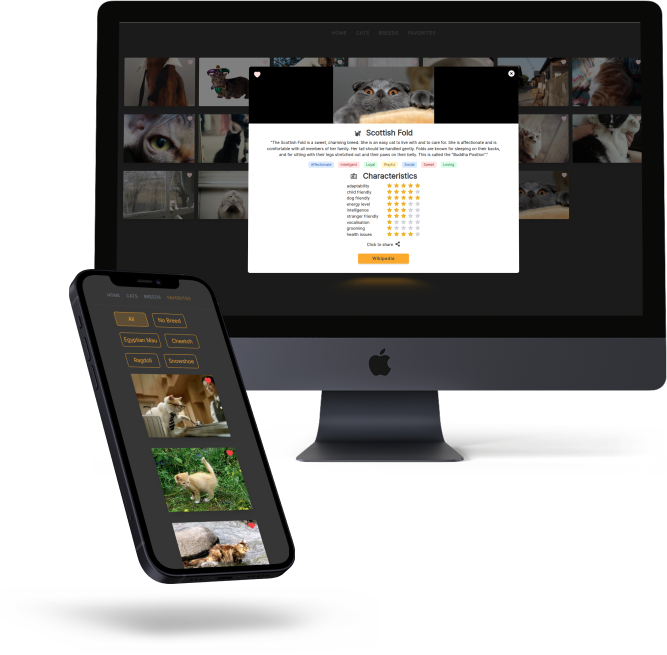

# cat-app :cat:
48 hours react-hackathlon.
The application is deployed here:
https://platform2-0-react-challenge-cat-lover-olol.vercel.app/

### Description 

The goal was to build a cat-API application using React and tailwind

### User Stories

* At first render, 10 cat pictures are loaded. The user can press "Load more" button, to see 10 more.
* The user can mark a cat image as favorite.
* The user can preview all of his favorite cats and filter them based on their breed
* The user can click on each and every cat image. A modal must be rendered with extra info related to the selected cat.
* The user can select a particular breed. When that happens, the app must render α modal with info about the selected breed.

### Preview

